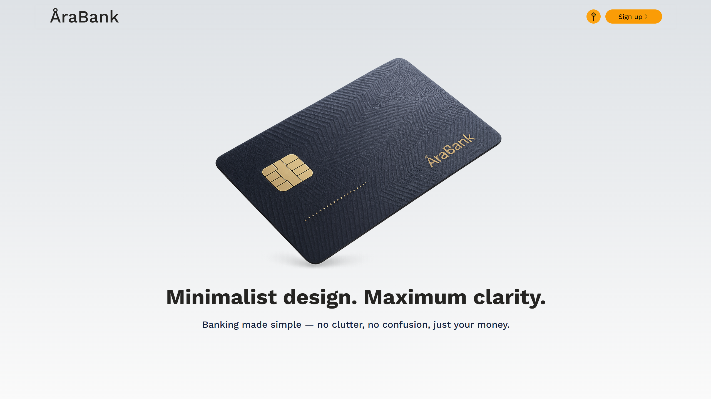
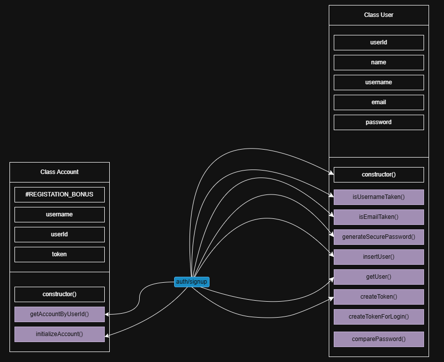
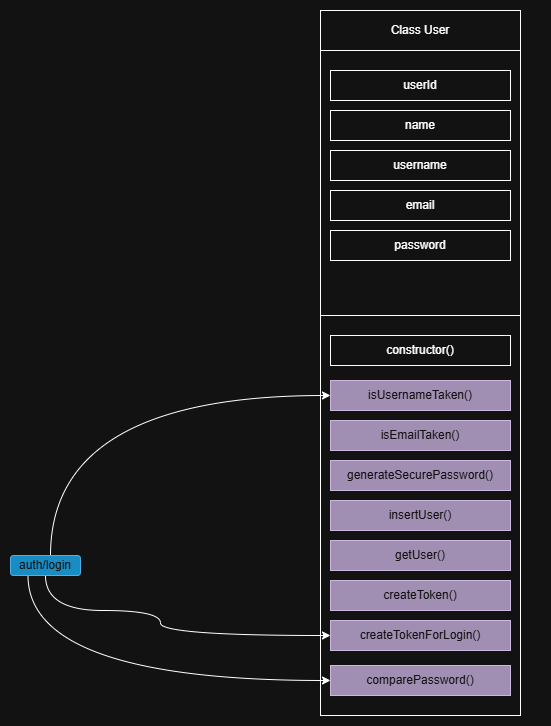

# Banking App with JavaScript and Node.js

## Project developed with JavaScript, Node.js and Prisma ORM to test CRUD operations, API calls and to implement CI/CD

This is a Banking application in progress, tested with Playwright POMs and Cypress with actions, API calls with Postman, and containerized with Docker to be fully independent.

## Major project implementations:

- Created a Frontend with vanilla JavaScript, HTML and CSS
- Implemented a Backend server with Node.js to serve static files and listen for API calls
- Implemented a simple node sqlite database
- Replaced the node sqlite database with a Prisma ORM with PostgreSQL as a provider
- Implemented a Dockerfile to containerize the application
- Implemented a Github actions file to build the app and run tests on push
- Implemented a Cypress Data Fixture and Custom Action lo sign up a user dynamically

## Frontend Diagram

.png>)

## /auth/signup

## /auth/login

## Updates

APR 13 - APR 20

- Implemented a Cypress getByTestId custom action to get selectors easily, to follow the similar playwright built-in selector implementation
